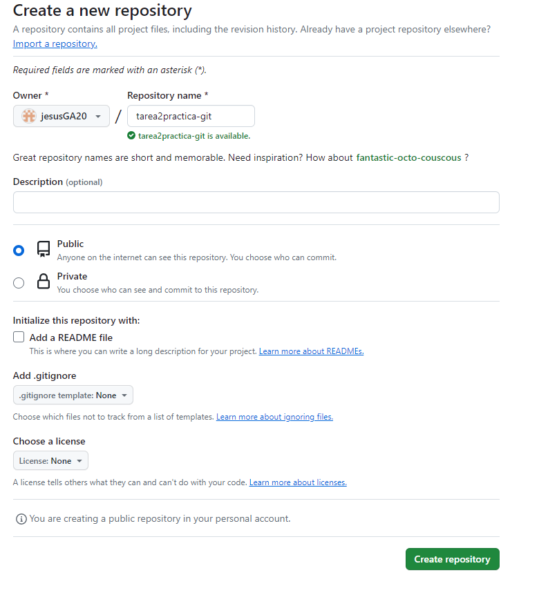
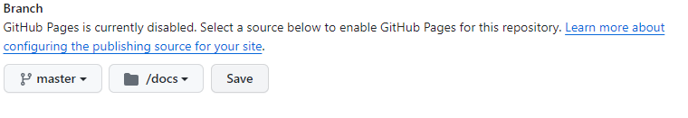

# Tarea 2, Practica Git

## Jesús Gómez Albarracín
## Lenguajes de marcas y sistemas de gestión de información
## IES Aguadulce
## 1ºDAW
## https://jesusga20.github.io/tarea2practica-git/

Uso de Git mediante la terminal git bash. Las instrucciones y sus resultados deben mostrar como
bloques de código markdown:

### Creación del repositorio en nuestro ordenador (init)
usando el comandon **get init** creo el repositorio donde ire subiendo los documentos
```
maniana@DAMDAW1-09 MINGW64 ~/Desktop/tarea2practica-git
$ git init
Initialized empty Git repository in C:/Users/maniana/Desktop/tarea2practica-git/.git/
```
### Creación de un commit inicial (add, status, commit, log)
añado los archivos al repositorio con el comando **add .** (al poner el punto añado todos de golpe), lo compruevo con el **status** y lo subo con el **commit**, luegon miro el **log** paraver los *commit* realizados
```
maniana@DAMDAW1-09 MINGW64 ~/Desktop/tarea2practica-git (master)
$ git add .

maniana@DAMDAW1-09 MINGW64 ~/Desktop/tarea2practica-git (master)
$ git status 
On branch master

No commits yet

Changes to be committed:
  (use "git rm --cached <file>..." to unstage)
        new file:   README.md


maniana@DAMDAW1-09 MINGW64 ~/Desktop/tarea2practica-git (master)
$ git commit -m "añado documentacion"
[master (root-commit) a424fdb] añado documentacion
 1 file changed, 40 insertions(+)
 create mode 100644 README.md

maniana@DAMDAW1-09 MINGW64 ~/Desktop/tarea2practica-git (master)
$ git log
commit a424fdb1867283234adfeda8ceee2abba1034ac5 (HEAD -> master)
Author: repaso <repaso@lmsgi.edu>
Date:   Mon Jan 15 08:43:17 2024 +0100

    añado documentacion
```
### Creación del repositorio en Github
Acedo a la pagina **github** y le doy a crear un nuevo repositorio, tras lo cual, le doy a añadir nuevo usuario y añado al profesor



### Añadir el remoto al repositorio local (branch, remote)
compruevo que la rama **master** este en linea con los comandos **branch** y **remote**
```
maniana@DAMDAW1-09 MINGW64 ~/Desktop/tarea2practica-git (master)
$ git remote add origin https://github.com/jesusGA20/tarea2practica-git.git

maniana@DAMDAW1-09 MINGW64 ~/Desktop/tarea2practica-git (master)
$ git remote -v
origin  https://github.com/jesusGA20/tarea2practica-git.git (fetch)
origin  https://github.com/jesusGA20/tarea2practica-git.git (push)

maniana@DAMDAW1-09 MINGW64 ~/Desktop/tarea2practica-git (master)
$ git branch -v
* master a424fdb añado documentacion

```
### Subir el repositorio a Github (push) 
subo todos los documentos nuevos al repositorio con los botones del **visual studio** del control de codigo fuente, para luego subir todo a *github* con el comando **push**
```
maniana@DAMDAW1-09 MINGW64 ~/Desktop/tarea2practica-git (master)
$ git status 
On branch master
nothing to commit, working tree clean

maniana@DAMDAW1-09 MINGW64 ~/Desktop/tarea2practica-git (master)
$ git push origin master 
Enumerating objects: 9, done.
Counting objects: 100% (9/9), done.
Delta compression using up to 12 threads
Compressing objects: 100% (8/8), done.
Writing objects: 100% (9/9), 87.38 KiB | 17.48 MiB/s, done.
Total 9 (delta 1), reused 0 (delta 0), pack-reused 0
remote: Resolving deltas: 100% (1/1), done.
To https://github.com/jesusGA20/tarea2practica-git.git
 * [new branch]      master -> master

```
### Comprobar que está subido a Github


## Publicación en Github Pages:
antes que nada creo la carpeta **docs** con el archivo **index** dentro

### Configurar el repositorio para que publique el directorio raíz en Github Pages.
para esto, he cliqueado en *settings*, luego en *pages*, y en la parte de *branch*, colocamos en master y elegimos el archivo /docs y le damos a save


### Mostrar los despliegues (deployments).
compruevo que se haya subido bien los desplieges

### Mostrar la página web.


